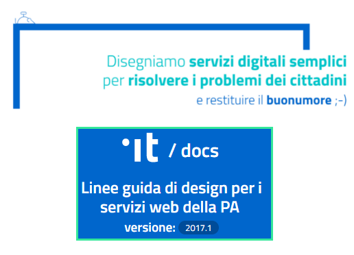
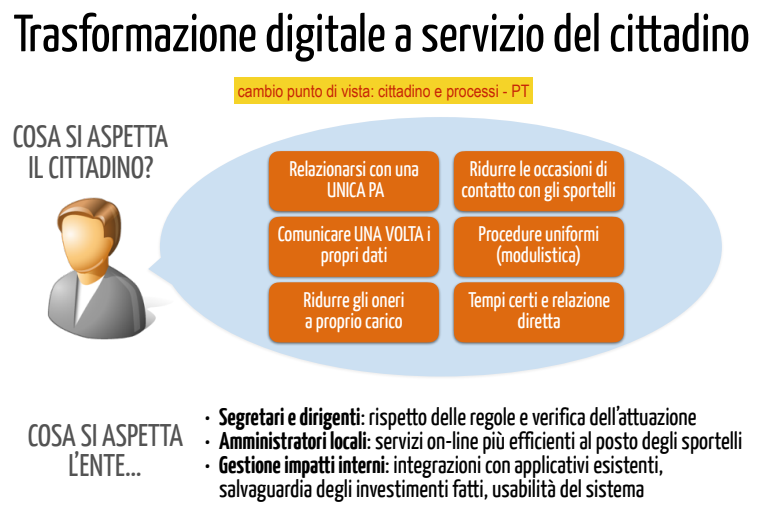
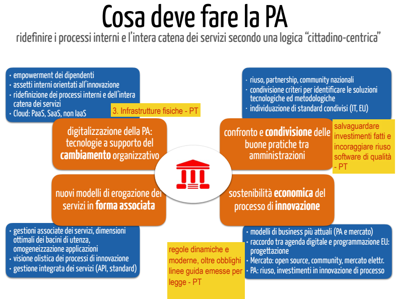

======================================================
Cap 5 | Attuare il Co-Design dei servizi pubblici per essere più vicini alle esigenze dei cittadini
======================================================

.. figure:: imgrel/codesign.png
   :alt: codesign
   :align: center
   
   il co-design con i cittadini nelle politiche del Governo Aperto (immagine lic. CC BY http://democratieouverte.org)

Nella fase che precede la creazione del software, per gestire digitalmente il processo dentro un ufficio, entra in gioco il `service co-design <https://design-italia.readthedocs.io/it/stable/doc/service-design.html>`_  (dalle `Linee guida di design per i servizi web della PA <https://design-italia.readthedocs.io/it/stable/index.html>`_  a cura dell’AgID).

Quando si progettano le piattaforme digitali, spesso (in passato) non si tiene in considerazione il parere o il punto di vista di chi quella piattaforma (e i relativi strumenti) la deve usare come utilizzatore finale (cittadino/ azienda/ associazione). E capita che non viene nemmeno tenuta in considerazione l’opinione/esigenza del dipendente che la deve usare quotidianamente dall’interno della PA per la gestione dei processi.

|

5.1 E ti arrabbi se le piattaforme sono difficili da usare
^^^^^^^^^^^^^^^^^^^^^^^^^^^^^^^^^^^^^^^^^
.. figure:: imgrel/arrabiato.gif
   :alt: arrabiato
   :align: center
   
Quest’ultimo aspetto comporta inevitabilmente un insofferenza del dipendente nell'uso di quel software gestionale, un antipatia che si trasforma in rabbia, e che col passar del tempo porta a detestare il proprio lavoro e a non svolgerlo in maniera corretta. Una condizione da evitare per tutelare il benessere dei dipendenti della PA e dei cittadini!

|

5.2 La persona al centro del design dei servizi web della PA
^^^^^^^^^^^^^^^^^^^^^^^^^^^^^^^^^^^^^^^^^

Il Ministero per la Semplificazione e PA ha redatto Linee Guida su `“Appalti web Human Centred Design, per realizzare capitolati tecnici di gara con  una progettazione orientata all'utente” <http://www.funzionepubblica.gov.it/sites/funzionepubblica.gov.it/files/linee_guida_appalti_hcd_beta01_0.pdf>`_ .

↓ Queste di seguito sono le terminologie, del Ministero della Funzione Pubblica (http://www.funzionepubblica.gov.it/mission), che devono guidare la PA nella progettazione di applicativi che gestiscono processi interni e servizi erogati alla colettività (user experience, usabilità, human centred design)  ↓

.. nota::
   **Human-Centred Design (HCD)**  
   
   Lo Human-Centred Design (HCD) è un approccio progettuale che mira a coinvolgere e a prendere in considerazione i punti di vista, i bisogni e i desiderata dei destinatari di prodotti e servizi nelle diverse fasi di progetto, in modo da incorporarli precocemente e più efficacemtne nel prodotto finito.
   
.. nota::
   **Usabilità** 
   
   L'usabilità è un concetto definito dalla norma 9241 'Ergonomic requirements for office work with visual display terminals (VDTs)' dell' ISO (International Organization for Standardization), come "il grado con cui un prodotto può essere usato da specifici utenti per eseguire specifici compiti con efficacia, efficienza e soddisfazione in uno specifico contesto d'uso". In pratica definisce il grado di facilità e soddisfazione con cui avviene un'interazione uomo-artefatto.  
   
.. nota:: 
   **User Experience (UX)** 
   
   L'espressione User Experience (in italiano esperienza d'uso) indica la condizione dell’utente durante l’interazione con un prodotto, un sistema o un servizio considerata nei suoi aspetti esperienziali, emozionali e valoriali. Riguarda anche ciò che l’utente percepisce in termini di utilità, semplicità ed efficienza nell’uso.

|    

5.3 Il Design per i servizi web della PA
^^^^^^^^^^^^^^^^^^^^^^^^^^^^^^^^^^^^^^^^^

Nel 2017 nasce il `Design System della Pubblica Amministrazione Italiana <https://designers.italia.it/>`_ , un punto di riferimento per il design della PA con guide, strumenti e un forum di confronto per favorire la collaborazione e promuovere il ruolo dello human centered design nello sviluppo dei servizi pubblici.

Oggi esiste un attiva comunità nazionale (forum) a supporto del design per il web della PA:  https://forum.italia.it/c/design.

Dal Team Trasformazione Digitale dell’AGID vengono rese disponibili le `Linee guida di design per i servizi web della PA <https://design-italia.readthedocs.io/it/stable/index.html>`_.

“*Capire cosa serve davvero ai cittadini è fondamentale per avere ben chiare le priorità e progettare servizi digitali efficaci*” è un  `post della community Design Italia <https://medium.com/designers-italia/servizi-digitali-a-misura-di-cittadino-le-domande-giuste-da-farsi-88bea3064770>`_  nel quale viene approfondito il modus operandi per progettare servizi digitali efficaci.

|

5.4 Architettura dell’informazione
^^^^^^^^^^^^^^^^^^^^^^^^^^^^^^^^^^^^^^^^^
.. figure:: imgrel/architettura.png
   :alt: architettura
   :align: center
   

Un importante pilastro dei servizi web della PA è rappresentato dall’`Architettura dell’informazione <https://design-italia.readthedocs.io/it/stable/doc/content-design/architettura-dell-informazione.html>`_ — *organizzazione semantica e logica di ambienti informativi, …, serve a rendere i servizi pubblici più facili da trovare, da capire e da usare.  Progettare l’architettura dell’informazione significa soddisfare i bisogni degli utenti, creando contenuti utili e rilevanti che possano adattarsi al contesto di fruizione. …. a titolo di esempio, alcune delle macro funzioni tipiche di un sito pubblico*:

- *identificare l’utente*
- *consentire la prenotazione/iscrizione*
- *consentire il pagamento* 
- *informare, regolamentare*
- *interagire, comunicare con l’utente*
- *archiviare/conservare informazioni*
- *proporre un lavoro a persone e aziende*
- *autorizzare l’utente a fare qualcosa.*

Questa check list dovrebbe essere verificata (da uno staff competente interno) in ogni sito web di ogni Pubblica Amministrazione per verificare l’efficacia del modello esistente di architettura dell’informazione e ove occorre apportare adeguate azioni correttive.

“*Fatti trovare. Arrivano i consigli SEO per i siti pubblici*” è un `post della community Designers Italia <https://medium.com/designers-italia/fatti-trovare-arrivano-i-consigli-seo-per-i-siti-pubblici-2bf4fb1d60d3>`_  che focalizza l’attenzione su cosa fare per verificare se il sito web della PA è facile da trovare (dagli utenti, dai motori di ricerca) e cosa fare per incrementare la visibilità dei contenuti e servizi.`post della community Designers Italia <https://medium.com/designers-italia/fatti-trovare-arrivano-i-consigli-seo-per-i-siti-pubblici-2bf4fb1d60d3>`_

|

5.5 Il FORMEZ forma la PA sulla qualità e design dei servizi web
^^^^^^^^^^^^^^^^^^^^^^^^^^^^^^^^^^^^^^^^^
.. figure:: imgrel/eleadership.PNG
   :alt: eleadership
   :align: center
   
   la presentazione del corso sulla qualità e design dei servizi web a cura del Formez
   

Il FormezPA è un ente che ha investito tantissimo sulla formazione concernente `“la qualità e design dei servizi web della PA” <http://eventipa.formez.it/node/57591>`_  — ad esempio — con un valido corso online dedicato a dirigenti e funzionari della Pubblica Amministrazione e con giornate informative e webinar sulla `e-leadership <http://eventipa.formez.it/search/site/eleadership>`_.

|

5.6 Sicurezza nei servizi web della PA
^^^^^^^^^^^^^^^^^^^^^^^^^^^^^^^^^^^^^^^^^

Oltre al design è fondamentale assicurare la sicurezza dei servizi web della PA. A tal proposito l’AgID rende disponibili  le `“Linee guida per lo sviluppo del software sicuro nella Pubblica amministrazione” <http://www.agid.gov.it/notizie/2017/12/21/piano-triennale-line-linee-guida-sviluppo-del-software-sicuro>`_. Obiettivo: definire un’architettura della sicurezza per servizi web della PA. Queste linee guida si compongono di 4 ambiti tematici:
- Linee Guida per l’adozione di un ciclo di sviluppo di software sicuro
- Linee Guida per lo sviluppo sicuro di codice
- Linee Guida per la configurazione per adeguare la sicurezza del software di base
- Linee Guida per la modellazione delle minacce e individuazione delle azioni di mitigazione conformi ai principi del Secure/Privacy by Design.

Sempre sulla sicurezza dei servizi ICT esistenti, l’AGID prevede un `adeguamento delle Pubbliche amministrazioni alle “Misure minime” <http://www.agid.gov.it/agenda-digitale/infrastrutture-architetture/cert-pa/misure-minime-sicurezza-ict-pubbliche-amministrazioni>`_  che dovrà avvenire tramite la redazione e invio (ad AGID) del cosiddetto Modulo di implementazione.

|

5.7 Cosa tenere in considerazione nel co-design dei servizi digitali: i cittadini ne saranno felici perchè loro utilizzeranno i servizi!
^^^^^^^^^^^^^^^^^^^^^^^^^^^^^^^^^^^^^^^^^

Nel caso di software che gestiscono processi amministrativi nella PA, in cui è prevista una forte componente di comunicazione bidirezionale tra dipendenti pubblici e cittadini (**inoltro richieste ⇄ per ottenimento servizi**), la Software House insieme ai dipendenti e dirigenti responsabili della gestione di processi amministrativi, dovrebbero avviare, prima dello sviluppo del software, alcune sessioni di **incontri pubblici con i cittadini per capire il modello di design della piattaforma che più soddisfa l’esigenza sia dei dipendenti pubblici che dei cittadini**. Questo è un punto fondamentale se si vuole che quella piattaforma gestionale sia utilizzata al meglio.

   
   slide della presentazione di `Gabriele Francescotto di OpenContent <https://drive.google.com/file/d/0B9q5qob_W3NiSVlFRTdEMFNwSmJjekR5aUJBYmgwMGFKbW13/view>`_  per l’Associazione dei Comuni Trentini ad un webinar di ForumPA
   
   

   
   slide della presentazione di `Gabriele Francescotto di OpenContent <https://drive.google.com/file/d/0B9q5qob_W3NiSVlFRTdEMFNwSmJjekR5aUJBYmgwMGFKbW13/view>`_ per l’Associazione dei Comuni Trentini ad un webinar di ForumPA
   
|

5.8 Servizi online facili da capire e usare
^^^^^^^^^^^^^^^^^^^^^^^^^^^^^^^^^^^^^^^^^
.. figure:: imgrel/uuu.PNG
   :alt: uuu
   :align: center
   
   questa interfaccia è molto facile da usare! … così pure mia nonna capisce (immagine lic. CC BY `Paul Clarke for the Digital Catapult <https://www.jisc.ac.uk/blog/codesign>`_)
   
Il service co-design deve costituire una vera e propria voce di capitolato speciale d’appalto nel procurement della piattaforma gestionale, deve prevedere un adeguato tempo di confronto tra dipendenti pubblici, software house e cittadini, e deve prevedere dei “risultati attesi” precisi.

**Software house: non solo codice di programmazione!**

Le software house devono abituarsi a trattare questa materia (service co-design per le interfacce dei software) sempre con maggiore professionalità e competenza, investendo nella formazione di figure ad hoc.

**La user experience positiva ormai è alla base del successo e dell’uso quotidiano dei prodotti e servizi digitali.**

.. figure:: imgrel/joke.png
   :alt: joke
   :align: center
   
   (immagine fonte http://www.starecat.com)
   
.. important::
   **Un interfaccia utente di una piattaforma online è come una barzelletta, se la devi spiegare, non funziona, non è buona**
   
|

5.9 I contenuti sul web devono essere pensati principalmente per la fruizione su smartphone
^^^^^^^^^^^^^^^^^^^^^^^^^^^^^^^^^^^^^^^^^

Le PA che redigono contenuti per i siti web istituzionali devono verificare la rispondenza alla check-list creata dalla comunità italiana dei designer di servizi pubblici http://designers.italia.it, per una navigazione a prova di smartphone. PA, `ecco alcuni punti che faresti bene a non dimenticare <https://medium.com/designers-italia/siti-web-a-prova-di-smartphone-ecco-alcune-cose-che-faresti-bene-a-non-dimenticare-2d1418ed784d>`_.

**Principi di design nei servizi web della PA inglese, stesso approccio adottato recentemente in Italia**

Il design dei servizi digitali online della PA deve seguire alcuni principi affinché i cittadini trovano i servizi accettabili. Ecco un esempio di Principi di Design adottati nel Regno Unito per la costruzione dei servizi digitali:
1. Iniziare con i bisogni degli utenti / Start with user needs — 
2. Fare meno / Do less — 
3. Fare Design con i dati / Design with data — 
4. Fare in modo da rendere facile ciò che è difficile / Do the hard work to make it simple — 
5. Replicare. Quindi replicare ancora / Iterate. Then iterate again — 
6. Questo è per tutti / This is for everyone — 
7. Comprendere il contesto / Understand context — 
8. Costruire servizi digitali, non siti web /Build digital services, not websites — 
9. Essere coerenti, non uniformi / Be consistent, not uniform — 
10. Rendere le cose aperte: rende le cose migliori /Make things open: it makes things better.

E la community **Designers Italia** riprende questo approccio. `“Tra tecnologia e design, le cose da non dimenticare mai quando progetti un servizio digitale” <https://medium.com/designers-italia/tra-tecnologia-e-design-le-cose-da-non-dimenticare-mai-quando-progetti-un-servizio-digitale-5260df1782d1>`_:

- Metti la tecnologia al servizio delle persone

- Coinvolgi i cittadini e comprendi i loro effettivi bisogni

- Parti dai dati

- Comprendi il contesto 

- Eroga servizi sicuri, disponibili sempre e ovunque

- Comunica efficacemente

- Crea solo processi necessari

- Rendi i dati aperti, condividi processi e strumenti

- Cerca di migliorare continuamente

- Valuta e monitora.

|

   
   

   

