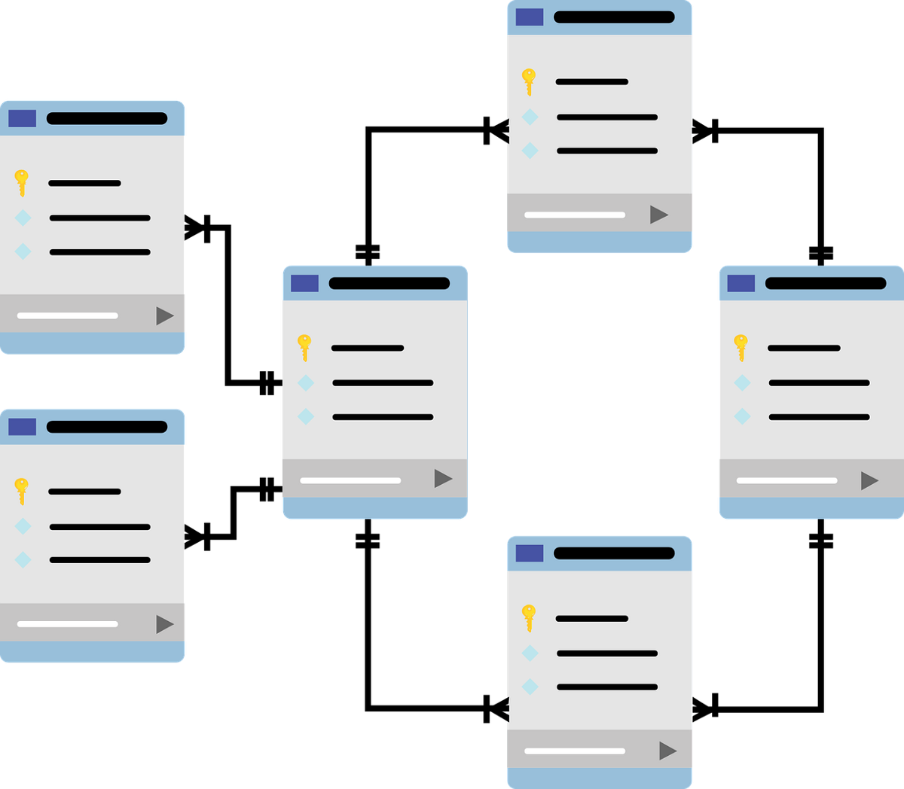
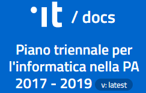

======================================================
Cap 4 | Assicurare la “interoperabilità” degli applicativi e delle relative banche dati
======================================================

.. figure:: imgrel/interoperabilita.png
   :alt: interoperabilità
   :align: center
   
   (Sara Di Giorgio, resp. gruppo tecnico CulturaItalia, Ministero Beni Att. Culturali e Turismo - `slide Standard e procedure per l’interoperabilità dei contenuti <https://www.slideshare.net/culturaitalia/standard-e-procedure-per-linteroperabilit-dei-contenuti>`_)

|
ABSTRACT | Questa è la grande sfida, e soprattutto nelle grandi PA è un lavoro più complesso proprio per l’interrelazione che esiste tra più processi amministrativi gestiti da più uffici con più applicativi. Diventa, così, una necessità di tutti gli uffici, condividere i dati contenuti nei vari database tematici.
   
Dipendenti e dirigenti svolgono quotidianamente un lavoro che rappresenta la gestione di un processo, ma può capitare che non sono abituati (o abili) a fare l’analisi del processo che gestiscono. In questi casi, l’analisi di processo tenta di farla (inevitabilmente, perchè qualcuno la deve pur fare) la software house che domanda quanto più possibile agli uffici,  cercando di capire che flusso di lavoro viene gestito quotidianamente, e proponendo software gestionali, che potrebbero, anche, non rispondere pedissequamente alle reali esigenze/necessità  lavorative dell’ufficio, oppure risultare ostici nell'espletamento delle azioni specifiche da compiere quotidianamente (interfacce non facili o troppe azioni da svolgere) per gestire il processo digitalmente.
   
|   

4.1 Essenziale stabilire le gerarchie delle banche dati della PA per l’interoperabilità
^^^^^^^^^^^^^^^^^^^^^^^^^^^^^^^^^^^^^^^^^^^^^
Nel lavoro da svolgere per assicurare l’interoperabilità delle banche dati sottese agli applicativi gestionali degli uffici pubblici, un  attività fondamentale consiste nello stabilire le gerarchie delle banche dati al fine di creare efficaci relazioni automatiche nell'aggiornamento dei dati a cascata nei vari database.

**Esempio**

Se una PA fa ruotare il personale in ottemperanza ai Piani anti corruzione e se effettua riorganizzazioni degli uffici, sarebbe ideale effettuare le movimentazioni del personale e i cambi (soppressione e/o nuova istituzione) degli uffici attraverso l’ausilio di un apposito applicativo gestionale. Tale applicativo avrebbe il compito di mettere in correlazione “digitale” diretta 1) la nuova architettura organizzativa degli uffici che si è venuta a creare con 2) l’applicativo del Protocollo informatico che includerà le nuove diciture (uffici) del nuovo assetto interno. L’ausilio di un applicativo ad hoc avrebbe il vantaggio di ridurre notevolmente i tempi di ripresa delle attività lavorative per la gestione dei procedimenti amministrativi.

.. note::

   Pillole curative:
   Esempio di gerarchia dei database: 
   
   Nome cognome ↴ 
                     Organigramma uffici ↴ 
                                          Protocollo ↴ 
                                                         ……………

Questa gerarchia dovrebbe essere applicata a tutti i database di una PA al fine di creare correlazioni automatiche nei vari ambiti di competenza, e di ridurre ridondanze e duplicazioni di dati. Conseguenza: il lavoro degli uffici viene ottimizzato per l’automatico scambio dati e la quotidiana produttività.

**L’ “interoperabilità” è** 
*«la capacità di organizzazioni diverse di interagire ……. »*

.. figure:: imgrel/interoperabilita2.png
   :alt: interoperabilità2
   :align: center
   
   l’interoperabilità ne `Il livello di digitalizzazione e di innovazione nelle PA e gli investimenti nel settore ICT <http://www.camera.it/application/xmanager/projects/leg17/attachments/documenti_acquisiti_commissione/documento_pdfs/000/000/008/AL-PwC.pdf>`_  una presentazione della `COMMISSIONE PARLAMENTARE DI INCHIESTA SUL LIVELLO DI DIGITALIZZAZIONE E INNOVAZIONE DELLE PA E SUGLI INVESTIMENTI COMPLESSIVI RIGUARDANTI IL SETTORE ICT <http://www.gazzettaufficiale.it/eli/id/2016/06/20/16A04670/sg>`_

|
**Interoperabilità e adozione di standard ICT per evitare il fenomeno del lock-in tecnologico**

.. figure:: imgrel/lockin.png
   :alt: lockin
   :align: center
   
   superare il fenomeno del lock-in — una presentazione della COMMISSIONE PARLAMENTARE DI INCHIESTA SUL LIVELLO DI DIGITALIZZAZIONE E INNOVAZIONE DELLE PA E SUGLI INVESTIMENTI COMPLESSIVI RIGUARDANTI IL SETTORE ICT

|

4.2 Le banche dati, la miniera della PA grazie all’interoperabilità
^^^^^^^^^^^^^^^^^^^^^^^^^^^^^^^^^^^^^^^^^^^^^^^^^^^^^^^^^^^^^^^^^^^

   
   gli uffici devono avvicinarsi, condividendo i database (immagine lic CCO pubblico dominio)
   
I dati sono la principale miniera con la quale lavorano gli uffici pubblici e la condivisione dei dati permette di velocizzare e ottimizzare i processi per erogare servizi e amministrare il territorio.

.. note::

   Pillole curative:
   
   **Per i dipendenti e dirigenti pubblici, avere accesso ai dati dei database, non chiederli.**
   
   Il personale di un ufficio, per lavorare, NON DEVE CHIEDERE DATI ad un altro ufficio della stessa PA, ma secondo livelli di gerarchia
   correlati alle mansioni svolte, questo personale deve ricevere dal proprio Dirigente, adeguate credenziali per poter accedere (ed
   ovviamente essere tracciato) a tutti i database necessari (anche quelli il cui data entry è svolto da altri uffici), per gestire il
   processo di competenza, senza più chiedere permesso a nessuno. Ovviamente qualcuno in un ufficio specifico deve essere deputato a
   verificare periodicamente la correttezza degli accessi effettuati ai database per la coerenza alle mansioni svolte da chi fa
   l'accesso.
   
|

4.3 Pannelli di controllo dei dati
^^^^^^^^^^^^^^^^^^^^^^^^^^^^^^^^^^^^^^^^^^^^^

Pannelli di controllo dei dati, i dati servono a: controllare, monitorare, verificare, correggere, progettare, pianificare,….

Ogni PA, oggi, deve poter disporre di pannelli di controllo nelle piattaforme digitali in uso, così da consultare/ controllare/ analizzare (dati) e verificare, capire l’efficacia delle scelte che vengono operate nel territorio amministrato. La condivisione dei dati (o come spesso viene definito, “incrocio dei dati”) tra più uffici permette di individuare, ad esempio, l’evasione tributaria, l’abusivismo commerciale ed edilizio, i fabbisogni di servizi pubblici nel territorio (mobilità, energia), permette di individuare le soluzioni per ridurre la spesa pubblica in diversi settori dei servizi pubblici (igiene ambientale, energia negli edifici pubblici, mobilità urbana, ecc.).

   
   un database collegato a tutti gli altri database (immagine lic. CCO pubblico dominio)
   
**L’utilità degli open data per le stesse PA, i “dati pubblici” in formato aperto**

I dati in formato aperto (open data) pubblicati negli ultimi anni rappresentano un inizio di politica virtuosa dell’amministrazione pubblica, ma ad oggi rari sono i casi in cui i dati pubblici di un ufficio sono in automatica correlazione/interazione con quelli di un altro ufficio, soprattutto per la mancata omogeneità (univocità) delle voci delle classi di informazioni contenuti nei database, per la mancanza di una esaustiva metadatazione dei dati, e per la mancanza di una **diretta relazione/comunicazione** tra le piattaforme in cui vengono gestiti i vari database degli uffici (interoperabilità).

.. figure:: imgrel/produrreopendata.png
   :alt: produrre open data
   :align: center
   
   architettura di un modello per la produzione e pubblicazione dei dati pubblici in formato aperto (slide della presentazione di Gabriele Francescotto di OpenContent per l’Associazione dei Comuni Trentini ad un webinar di ForumPA) https://drive.google.com/file/d/0B9q5qob_W3NiSVlFRTdEMFNwSmJjekR5aUJBYmgwMGFKbW13/view

|

4.4 Il DAF, Data Analytics Framework, pannello di visualizzazione dei dati delle PA
^^^^^^^^^^^^^^^^^^^^^^^^^^^^^^^^^^^^^^^^^^^^^
.. figure:: imgrel/daf.png
   :alt: daf
   :align: center
   
Se vogliamo provare a immaginare pannelli semplici di visualizzazione e narrazione dei dati di più PA, viene in grande aiuto il DAF, Data Analytics Framework, (oggi in versione “αlfa”) appena realizzato (ott_2017) dal Team Trasformazione Digitale dell’AgID (“partendo dai dati, interpretiamo il mondo e aiutiamo la società a prendere decisioni basate sui fatti”) e supportato da una  
`vasta comunità attiva in Italia <https://forum.italia.it/>`_.

|

4.5 I Vocabolari controllati come standard per l’interoperabilità
^^^^^^^^^^^^^^^^^^^^^^^^^^^^^^^^^^^^^^^^^^^^^

Per agevolare l’interoperabilità, il “Piano Triennale ICT 2017–19 della Pubblica Amministrazione” ha previsto l’adozione di `Vocabolari controllati e modelli dati <https://pianotriennale-ict.readthedocs.io/it/latest/doc/04_infrastrutture-immateriali.html#vocabolari-controllati-e-modelli-dati>`_  (al fine di favorire il processo di scambio dati tra Pubbliche amministrazioni è necessario: 1) armonizzare e standardizzare codici e nomenclature ricorrenti in vocabolari controllati, da utilizzarsi nell'implementazione delle basi di dati pubbliche,…. 2) identificare e definire modelli di dati -ontologie-  condivisi in particolare per dati trasversali ai diversi domini applicativi, ad es. persone, organizzazioni, servizi, luoghi).

|

4.6 Il Registro Europeo dei Metadati (MDR) per i “vocabolari controllati”
^^^^^^^^^^^^^^^^^^^^^^^^^^^^^^^^^^^^^^^^^^^^^

   
   http://publications.europa.eu/mdr/authority

Il Registro Europeo dei Metadati ha previsto una classe di `NAL, (Named Authority Lists), conosciuti più notoriamente come vocabolari controllati <http://publications.europa.eu/mdr/authority/>`_ , che sono adottabili dalle PA per armonizzare e standardizzare i codici necessari allo scambio di dati tra diverse PA. Basta usarli...!

.. figure:: imgrel/mdr2.png
   :alt: mdr2
   :align: center
   
   un esempio di `tabella <http://publications.europa.eu/mdr/resource/authority/data-theme/html/data-theme-ita.html#description>`_  che fornisce vari argomenti per classificare i dataset delle PA
   
|

4.7 I Metadati, necessari per spiegare i dati e aumentare l’interoperabilità
^^^^^^^^^^^^^^^^^^^^^^^^^^^^^^^^^^^^^^^^^^^^^

Al fine di rendere interoperabili i dati tra diversi uffici di diverse PA, fondamentale è il ruolo delle metadatazioni dei database. 
Un esempio banale per capire (e accade spesso): nella stessa PA in un database di un ufficio troviamo la voce “Via”, in un altro database di un altro ufficio, la voce “V.”, e in un altro database di un ulteriore ufficio troviamo la voce “via”, e tutti indicano la stessa cosa (cioè la via). Scrivere “via” in diverse modalità nei diversi database non permette un ideale interoperabilità dei dati e quindi ne deriva un uso o riuso poco utile sia per la PA nello svolgimento delle proprie attività istituzionali, che per la società nel caso di open data pubblicati.

- Nel caso di pubblicazioni di open data, la metadatazione dei dati che popolano un database tematico va, innanzitutto, adeguata allo standard DCAT_AP_IT definito nelle “Linee Guida nazionali (AgID) per la valorizzazione del Patrimonio Informativo Pubblico”, e fatta rispettare agli uffici/servizi/dipartimenti di ogni singola PA da un ufficio dati preposto (con un responsabile) che coordina e monitorizza tutti quegli uffici che hanno esigenza di rappresentare dati nei propri database.

- Nel caso di strutturazione o re-ingegnerizzazione di un applicativo gestionale della PA, le software house, interne o selezionate per specifici appalti, dovrebbero porre la massima attenzione su questi aspetti tecnici nel momento in cui progettano/implementano applicativi gestionali per gli uffici pubblici, assicurando, in questo caso, che tutti gli uffici che hanno esigenza, ad esempio, di rappresentare la voce “via” nei propri database lo facciano in maniera univoca evitando “Via”, “V.” o altre strane abbreviazioni inventate. I cosiddetti “vocabolari controllati” devono essere fatti rispettare in tutti i database degli applicativi gestionali.

|

4.8 L’Ufficio Dati nelle PA
^^^^^^^^^^^^^^^^^^^^^^^^^^^^^^^^^^^^^^^^^^^^^

In ogni PA, almeno di medie e grandi dimensioni, sarebbe ideale avere operativo, (oltre all'eventuale software house per i servizi informatici), un “ufficio Dati” con almeno un `data scientist <https://www.fbk.eu/it/event/la-data-science-come-professione/>`_ /strategist, un data analyst e un micro team di sviluppatori, (una sorta di staff di supporto al `Responsabile della Transizione al Digitale <https://www.spreaker.com/user/lapadigitale/1-chi-e-il-responsabile-per-la-transizio_1>`_), che svolgono le seguenti importanti attività:

- supervisionano costantemente le performance degli applicativi gestionali, le architetture delle banche dati, apportando continui miglioramenti per assicurare l’interoperabilità con le banche dati di altre grandi PA (es. INPS, Motorizzazione, Istat, Ministeri, ecc.);

- verificano il rispetto degli standard di sicurezza dei software in uso;

- assicurano l’efficacia delle procedure di conservazione documentale;

- verificano, attraverso l’adozione di vocabolari controllati, l’univocità delle classi di contenuti dei database, al fine di assicurare quanto più possibile l’interoperabilità di tutte le piattaforme vecchie e nuove in uso nello stesso ente;

- effettuano e condividono con gli uffici, attraverso appositi pannelli di controllo, visualizzazione di dati per comprendere fenomeni multi tema sul territorio (tipo il DAF), per verificare la reale efficacia delle azioni di governo;

- stabiliscono i criteri minimi che devono possedere le nuove piattaforme in termini di service design (esperienza d’uso per dipendenti pubblici e per cittadini — accessibilità);

- assicurano che gli applicativi pubblichino automaticamente online i dati degli uffici, fatti salvi i dati contenenti privacy degli individui, in formato aperto, (ciò che l’AgID definisce `“il patrimonio informativo della Pubblica Amministrazione” <https://www.dati.gov.it/content/linee-guida-nazionali-valorizzazione-patrimonio-informativo-pubblico-2016-0>`_  ) per la trasparenza amministrativa e per il riuso creativo che la collettività può fare. L’automatismo di pubblicazione dei dati dagli applicativi della PA dovrebbe essere assicurato dall'adozione delle `API <https://it.wikipedia.org/wiki/Application_programming_interface>`_, Application Programming Interface, come `raccomandato dal Team Trasformazione Digitale dell’AgID <http://pianotriennale-ict.readthedocs.io/it/latest/search.html?q=api&check_keywords=yes&area=default>`_ nel Piano Triennale per l’Informatica nella PA 2017–19.

   
   `Piano Triennale per l’Informatica nella PA 2017–19 <http://pianotriennale-ict.readthedocs.io/it/latest/index.html>`_

