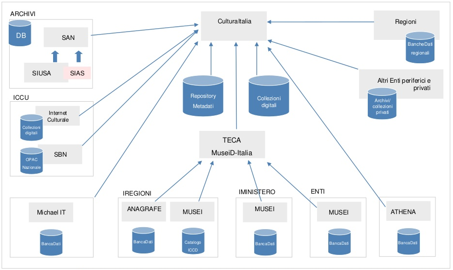

======================================================
Cap 4 | Assicurare l'“interoperabilità” degli applicativi e delle relative banche dati
======================================================

   
   (Sara Di Giorgio, resp. gruppo tecnico CulturaItalia, Ministero Beni Att. Culturali e Turismo - `slide Standard e procedure per l’interoperabilità dei contenuti <https://www.slideshare.net/culturaitalia/standard-e-procedure-per-linteroperabilit-dei-contenuti>`_)

   ABSTRACT | Questa è la grande sfida, e soprattutto nelle grandi PA è un lavoro più complesso proprio per l’interrelazione che esiste tra più processi amministrativi gestiti da più uffici con più applicativi. Diventa, così, una necessità di tutti gli uffici, condividere i dati contenuti nei vari database tematici.
   
   Dipendenti e dirigenti svolgono quotidianamente un lavoro che rappresenta la gestione di un processo, ma può capitare che non sono abituati (o abili) a fare l’analisi del processo che gestiscono. In questi casi, l’analisi di processo tenta di farla (inevitabilmente, perchè qualcuno la deve pur fare) la software house che domanda quanto più possibile agli uffici,  cercando di capire che flusso di lavoro viene gestito quotidianamente, e proponendo software gestionali, che potrebbero, anche, non rispondere pedissequamente alle reali esigenze/necessità  lavorative dell’ufficio, oppure risultare ostici nell'espletamento delle azioni specifiche da compiere quotidianamente (interfacce non facili o troppe azioni da svolgere) per gestire il processo digitalmente.
   
   
   

4.1 Essenziale stabilire le gerarchie delle banche dati della PA per l’interoperabilità
^^^^^^^^^^^^^^^^^^^^^^^^^^^^^^^^^^^^^^^^^^^^^
Nel lavoro da svolgere per assicurare l’interoperabilità delle banche dati sottese agli applicativi gestionali degli uffici pubblici, un  attività fondamentale consiste nello stabilire le gerarchie delle banche dati al fine di creare efficaci relazioni automatiche nell'aggiornamento dei dati a cascata nei vari database.

**Esempio**

Se una PA fa ruotare il personale in ottemperanza ai Piani anti corruzione e se effettua riorganizzazioni degli uffici, sarebbe ideale effettuare le movimentazioni del personale e i cambi (soppressione e/o nuova istituzione) degli uffici attraverso l’ausilio di un apposito applicativo gestionale. Tale applicativo avrebbe il compito di mettere in correlazione “digitale” diretta 1) la nuova architettura organizzativa degli uffici che si è venuta a creare con 2) l’applicativo del Protocollo informatico che includerà le nuove diciture (uffici) del nuovo assetto interno. L’ausilio di un applicativo ad hoc avrebbe il vantaggio di ridurre notevolmente i tempi di ripresa delle attività lavorative per la gestione dei procedimenti amministrativi.

.. note::

   Pillole curative:
   Esempio di gerarchia dei database: 
   
   Nome cognome ↴ 
                Organigramma uffici ↴ 
                                    Protocollo ↴ 
                                                ……………

------------

4.1.1 
~~~~~~~~~~~~~~~~~~~~~~~~~~~~~~~~
Successivamente a

4.1.2  
~~~~~~~~~~~~~~~~~~~~~~~~~~~~~~~~

Al fine d

4.2 
^^^^^^^^^^^^^^^^^^^^^^^^^^^^^^^^^^^^^^^^^^^^^^^^^^^^^^^^^^^^^^^^^^^

La Commissione 

4.2.1 
~~~~~~~~~~~~~~~~~~~~~~~~~~~~~~~~
In 

4.3  
^^^^^^^^^^^^^^^^^^^^^^^^^^^^^^^^^^^^^^^^^^^^^

Una 

4.3.1 Il 
~~~~~~~~~~~~~~~~~~~~~~~~~~~~~~~~
Il 

4.4 
^^^^^^^^^^^^^^^^^^^^^^^^^^^^^^^^^^^^^^^^^^^^^
Per 
