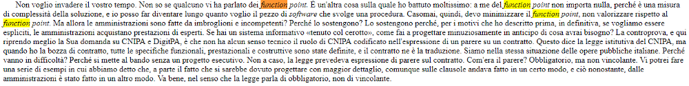
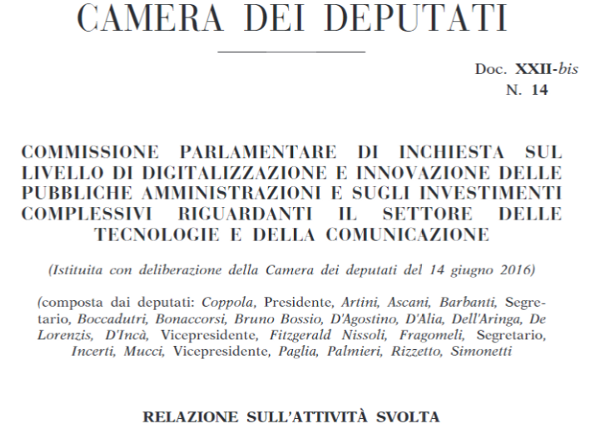
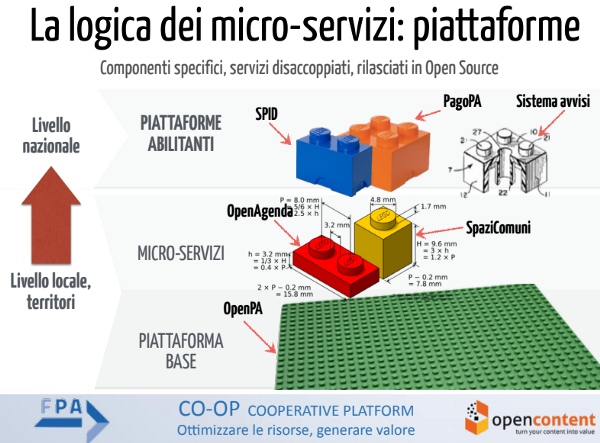

******************************************
Cap 6 | Costruire software gestionali e piattaforme digitali nella PA
******************************************

6.1 La metodologia del “function point”
^^^^^^^^^^^^^^^^^^^^^^^^^^^^^^^^^^^^^^^^^^^^^^^^^^^^^^^^^^^^^^^^^^^^

.. figure:: imgrel/functionpoint.png
   :alt: function point
   
   fondamentali del function point (fonte dell’immagine: `video <https://www.youtube.com/watch?v=N2-9GC7__P8>`_)
   
Il **Function point** è un “metodo di progettazione del software, definito nell'Azienda IBM da Allan Albrecht tra il 1975 ed il 1980”. Gli elementi di conteggio nella metodologia del “function point” sono:

- internal logical file (ILF), i file interni dell'applicazione;

- external interface file (EIF), i file esterni all’applicazione;

- external input (EI), attività elementari di Input;

- external output (EO), attività elementari di Output;

- external inquiry (EQ), attività elementari di interrogazione.

**Function point → una metodologia per arrivare al budget**

Al fine della creazione del software, questa metodologia riporta il “function point” (il punto di funzione) analizzato, al parametro “giorni” o “ore” di lavoro per la quantificazione in termini di budget di spesa. Non focalizza l’attenzione sulla quantità di righe di codice create, se sono tante o poche per lo stesso “punto di funzione”, importa solo i giorni o ora di lavoro per persona impiegati per la realizzazione.

|

6.2 Diego Piacentini (Team Trasformazione Digitale), sul "function point"
^^^^^^^^^^^^^^^^^^^^^^^^^^^^^^^^^^^^^^^^^^^^^^^^^^^^^^^^^^^^^^^^^^^^

.. figure:: imgrel/piacentini.PNG
   :alt: piacentini
   
   Ascoltiamo, in `un intervista <https://youtu.be/8j9U54m5Shk?t=1727>`_, cosa pensa il Commissario tecnico del `Team Trasformazione Digitale <https://teamdigitale.governo.it/>`_ dell’Agenzia per l’Italia Digitale, `Diego Piacentini <https://teamdigitale.governo.it/it/people/1-profile.htm>`_, del “function point”  nella fase di costruzione dei software gestionali

.. important:: 
   **Pillole curative**
   
   Da Piacentini arriva un messaggio chiaro → **costruire “digital service” da fruire online, non “siti web”**
   
|

6.3 Fabio Pistella (ex presidente del CNIPA), sul “function point”
^^^^^^^^^^^^^^^^^^^^^^^^^^^^^^^^^^^^^^^^^^^^^^^^^^^^^^^^^^^^^^^^^^^^

**Sempre sul “function point” altri punti di vista autorevoli**:

`Fabio Pistella <https://www.linkedin.com/in/fabio-pistella-846457ba/>`_, ex presidente del `CNIPA <https://it.wikipedia.org/wiki/DigitPA>`_ (Centro Nazionale per l’Informatica nella Pubblica Amministrazione, sostituito dal 2012 dall’Agenzia per l’Italia digitale), si esprime sul “function point”, in occasione della Commissione parlamentare di inchiesta sul livello di digitalizzazione e innovazione della Camera (`Seduta n. 6 di Martedì 17 gennaio 2017 <http://documenti.camera.it/leg17/resoconti/commissioni/stenografici/html/73/audiz2/audizione/2017/01/17/indice_stenografico.0006.html>`_):

   *Non voglio invadere il vostro tempo. Non so se qualcuno vi ha parlato dei function point. È un'altra cosa sulla quale ho battuto moltissimo: a me del function point non importa nulla, perché è una misura di complessità della soluzione, e io posso far diventare lungo quanto voglio il pezzo di software che svolge una procedura. Casomai, quindi, devo minimizzare il function point, non valorizzare rispetto al function point. Ma allora le amministrazioni sono fatte da imbroglioni e incompetenti? Perché lo sostengono? Lo sostengono perché, per i motivi che ho descritto prima, in definitiva, se vogliamo essere espliciti, le amministrazioni acquistano prestazioni di esperti. Se hai un sistema informativo «tenuto col cerotto», come fai a progettare minuziosamente in anticipo di cosa avrai bisogno? La controprova, e qui riprendo meglio la Sua domanda su CNIPA e DigitPA, è che non ha alcun senso tecnico il ruolo di CNIPA codificato nell'espressione di un parere su un contratto. Questo dice la legge istitutiva del CNIPA, ma quando ho la bozza di contratto, tutte le specifiche funzionali, prestazionali e costruttive sono state definite, e il contratto ne è la traduzione. Siamo nella stessa situazione delle opere pubbliche italiane. Perché vanno in difficoltà? Perché si mette al bando senza un progetto esecutivo. Non a caso, la legge prevedeva espressione di parere sul contratto. Com'era il parere? Obbligatorio, ma non vincolante. Vi potrei fare una serie di esempi in cui abbiamo detto che, a parte il fatto che si sarebbe dovuto progettare con maggior dettaglio, comunque sulle clausole andava fatto in un certo modo, e ciò nonostante, dalle amministrazioni è stato fatto in un altro modo. Va bene, nel senso che la legge parla di obbligatorio, non di vincolante*.

   
   ricerca del termine “function point” nel testo dei lavori della Camera dei Deputati nella seduta del 17 gennaio 2017
   
**Sul “function point” si esprime anche la Commissione parlamentare di inchiesta sul livello di digitalizzazione e innovazione delle PA**:

.. figure:: imgrel/coppola.png
   :alt: Coppola
   
|

6.4 Commissione parlamentare di inchiesta sulla digitalizzazione della PA, sul “function point”
^^^^^^^^^^^^^^^^^^^^^^^^^^^^^^^^^^^^^^^^^^^^^^^^^^^^^^^^^^^^^^^^^^^^

Paolo Coppola, onorevole della Commissione parlamentare di inchiesta sul livello di digitalizzazione e innovazione delle PA, dopo un anno di lavoro di indagine sulla digitalizzazione delle PA rileva, in `un articolo <https://www.agendadigitale.eu/cultura-digitale/coppola-la-pa-dello-spreco-digitale-la-nostra-galleria-degli-orrori-rivela-la-vera-causa/>`_, che “la radice delle inefficienze sta nell'assoluto disinteresse della PA riguardo alle competenze digitali”. 

**Qualcuno nelle PA deve cominciare, quindi, a interessarsi di competenze digitali**, avviando cicli di sensibilizzazione e formazione ai dirigenti e ai dipendenti, così come si fa con i corsi obbligatori per la conoscenza dei Piani Anti Corruzione ai sensi del Decreto Legislativo 33/2013.

   
Sul “**function point**” così relaziona, a fine ottobre 2017, la **Commissione parlamentare di inchiesta sul livello di digitalizzazione e innovazione delle PA** nella `relazione finale (al paragrafo Indicazioni Conclusive) <https://relazione-commissione-digitale.readthedocs.io>`_: 

   *per quanto riguarda il procurement dei sistemi informativi, sarebbe di utilità aggiornare le linee guida, imponendo una disciplina dei bandi che preveda studi di fattibilità e progettazione dei sistemi informativi prima della messa a bando della realizzazione, in modo da specificare meglio gli obiettivi di digitalizzazione e gli indicatori di risultato del progetto. Si deve uscire dalla logica del massimo ribasso sul costo dei function point e passare ad una logica di prodotto, con opportune metriche di qualità*. 

`Qui una sintesi <https://medium.com/@cirospat/sintesi-zen-del-report-della-commissione-parlamentare-dinchiesta-sul-livello-di-digitalizzazione-4bc10e081fa4>`_ della relazione della Commissione parlamentare.

|

6.5 I “micro servizi” nella progettazione del software per la PA
^^^^^^^^^^^^^^^^^^^^^^^^^^^^^^^^^^^^^^^^^^^^^^^^^^^^^^^^^^^^^^^^^^^^

Probabilmente le software house chiamate a costruire piattaforme digitali nella PA dovrebbero/potrebbero spostare una dose di attenzione e risorse dal metodo del “function point” ad altri aspetti della progettazione:

- il co-design del servizio digitale da realizzare, con attenzione agli aspetti di facile usabilità sia dal lato utente cittadino che dal lato dipendente pubblico, e agli aspetti di facile implementazione della piattaforma, prevedendo un approccio progettuale per micro-servizi (tanti piccoli servizi che svolgono funzioni specifiche e interoperabili tra loro anziché una sola mega piattaforma complessa);

- le buone prassi delle altre amministrazioni pubbliche che hanno realizzato piattaforme digitali oggi usate quotidianamente, e per questo fare riferimento al cosiddetto “**riuso applicativo**”, uno spazio online dove molte PA hanno censito il software progettato, utilizzato e messo a disposizione gratuitamente di altre Amministrazioni.

   
   la logica dei micro-servizi nelle piattaforme digitali dell’Associazione dei Comuni Trentini (da un `webinar con intervento di Gabriele Francescotto <https://drive.google.com/file/d/0B9q5qob_W3NiSVlFRTdEMFNwSmJjekR5aUJBYmgwMGFKbW13/view>`_)

.. nota::
   Pillole curative:
   Software, **non solo “cosa fa” →  ma “come lo fa”** 
   
   Inserire — nella costruzione del software — un focus, oltre al “cosa fa”, anche al “come lo fa”, tenendo sempre in mente come riferimento 1)la semplificazione dei processi e 2)l’esperienza d’uso del software.

Oggi, rispetto agli anni 80, considerati i progressi nel campo della Tecnologia della Comunicazione e dell’Informazione, c’è un ampia disponibilità di strumenti e metodi (mercato) per analizzare i criteri di costruzione di un applicativo necessario a gestire in digitale i processi della PA, ed è più facile effettuare una scelta tenendo in considerazione “come” i software gestiscono le singole azioni, quelle azioni con cui dipendenti e cittadini dovranno interfacciarsi quotidianamente su un monitor.

Gli strumenti per la generazione e la diffusione di servizi digitali sono quelli previsti dal `cap. 7 del Piano Triennale per l’Informatica nella PA 2017–2019 <http://pianotriennale-ict.readthedocs.io/it/latest/doc/07_strumenti-per-la-generazione-e-la-diffusione-di-servizi-digitali.html>`_.

.. figure:: imgrel/it.png
   :alt: it
