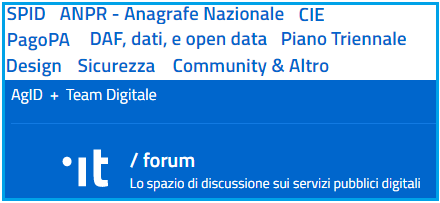
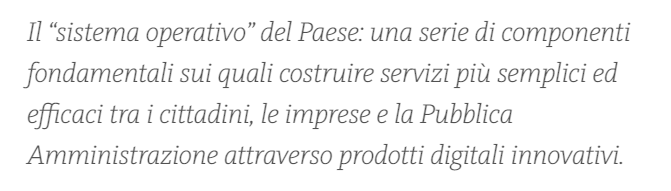
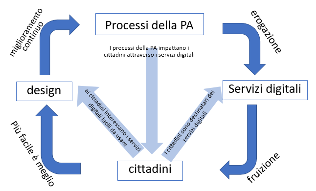

================================================
Cap 7 | Conclusione (si fa per dire)
================================================

Le iniziative  di partecipazione e coinvolgimento dei cittadini nella vita pubblica, avviate negli ultimi anni da diverse amministrazioni territoriali, dovrebbero focalizzare molta attenzione (fissando obiettivi e risultati attesi) proprio sulle attività di co-design dei servizi pubblici, servizi digitali in primis.

.. figure:: imgrel/4persone.PNG
   :alt: incontro
   :align: center
   
   partecipazione della PA, software house e cittadini per il design dei servizi digitali (immagine lic. CC BY SA `Marco Antonio Torres via Flickr <https://www.flickr.com/photos/torres21/3052366534>`_)
   
Perchè sui servizi digitali, e relativa usabilità, si giocheranno le principali sfide delle PA nei prossimi anni. Servizi da fruire innanzitutto in mobilità. Una PA con tutti i suoi servizi digitali (oggi in parte su cartaceo), pienamente e felicemente usati dai cittadini, sarà candidata a creare uno status di città gradevole in cui vivere, che riduce la mobilità legata allo scambio e movimentazione di carta.

|
   
7.1 Competenze e abilità ICT necessarie nella PA! Formazione e comunicazione interna
^^^^^^^^^^^^^^^^^^^^^^^^^^^^^^^^^^^^^^^^
Non è solo un fattore di eliminazione della carta su cui viene stampato un certificato/documento di un ufficio pubblico. Quanto ampiamente analizzato lo considero un percorso articolato e strutturato per la **costruzione di un rapporto fiduciario e intelligente e bidirezionale tra chi amministra pubblicamente un territorio e i cittadini che ci vivono**. Per costruire questo nuovo rapporto credo fermamente ci sia bisogno di fare i passi esposti. Per fare questi passi **è necessario disporre di competenze adeguate (ICT skills) all’interno delle PA**, per attuare concretamente la fatidica “transizione al digitale”.

**Formazione**

La **formazione** è uno dei pilastri fondamentali per costruire le competenze digitali, anche di base, nei dirigenti e dipendenti della PA. Formazione acquisita in modalità formale (corsi ad hoc nel PAF, Piano Annuale della Formazione), ma anche informale attraverso momenti di incontro e confronto con soggetti ed organizzazioni della società civile (**hackathon**, **webinar**, **mooc**, **open data day**, **settimana dell'amministrazione aperta**, **learning objects del FormezPA**, ...). In questo secondo caso community come quelle attive sugli open data (Spaghetti open data, OpendataSicilia, OpendataPuglia, Sardiniaopendata,...) rappresentano validi animatori della formazione e sensibilizzazione sul digitale.
E' necessario per i soggetti della Pubblica Amministrazione rendersi disponibili ad aquisire conoscenze nuove da spendere poi all'interno degli uffici per innovare la gestione dei processi nella transizione alla modalità digitale. La contaminazione culturale (attraverso le competenze) dall'esterno verso l'interno della PA è necessaria per un cambiamento positivo.

**Comunicazione interna**

E' molto importante generare all'interno di una stessa PA un flusso di comunicazione tra i dipendenti e tra i dirigenti, al fine di rendere condiviso un livello ideale di informazioni utili a tutti.
Da decenni è in uso la prassi delle "Circolari" che rappresenta una comunicazione di tipo unidirezionale top-down. Questo tipo di comunicazione non permette la nascita di interazioni di tipo multi direzionale tra i dipenenti/dirigenti in quanto le circolari vengono solo recepite (accettate). 

I forum online rappresentano un valido strumento di comunicazione e condivisione delle informazioni e delle iniziative intraprese dentro una PA. Alcune Pa già utilizzano i forum (ad esempio il **Google Group**) traendone vantaggi in termini di condivisione rapida delle informazioni. Capita sovente che alcuni uffici non sono a conoscenza di un servizio digitale attivato da un altro ufficio per gestire processi di lavoro, e ciò può portare ad eventuali duplicazioni di adozione di analoghi applicativi a quelli utilizzati da uffici della stessa PA (soprattutto in quelle PA dove non c'è la società in house per i servizi informativi). 

L'utilizzo dei forum online tematici permette di velocizzare i processi di comunicazione interna rendendo fertile il terreno della proposizione di iniziative volte a migliorare le prestazioni degli uffici nella gestione delle attività di competenza. Il forum permette, ad esempio, di ottimizzare i processi di lavoro nei casi in cui i dipendenti/dirigenti di un ufficio sono alla ricerca di servizi o database che sono già a disposizione di altri uffici. 

Nella gestione di specifici progetti che vedono impegnati più uffici di una PA, oltre all'ormai consueta abitudine dell'uso di email come strumento di comunicazione, risulta molto vantaggiosa, per la produttività, l'adozione di piattaforme quali **Slack** che oltre alla comunicazione in tempo reale multi utente, permettono anche la condivisione documentale. La piattaforma Slack **è utilizzata dal Team Trasformazione Digitale dell'AGID** per la gestione di attività progettuali **insieme ad alcune PA pilota**, è gratuito e molto facile da usare, e quindi rappresenta uno strumento usabile da tanti dipendenti e dirigenti delle PA in Italia.

.. note::
   Pillole curative:
   
   **Servono dirigenti e funzionari competenti in ICT nella PA**. 
   E' la conclusione alla quale è arrivata la Commissione parlamentare di inchiesta su livello di digitalizzazione della PA, che condivido pienamente.
   Se le competenze ICT sono assenti negli uffici pubblici, nessuna versione di CAD e di PIANO TRIENNALE ICT sarà in grado di far erogare pienamente ad una PA servizi (e gestire processi) digitali!
   Quindi servono dipendenti e dirigenti competenti in ICT nella PA: 
   
   1) si scovano nei camerini in cui spesso si trovano non valorizzati da anni (dipendenti anche con capacità di sviluppatore software),
   
   2) si fa in modo che entrino nella PA (dipendenti/dirigenti a contratto/progetto), 
   
   3) si formano con percorsi e progetti ad hoc e con una costante formazione "informale"

|

.. figure:: imgrel/cad.png
   :alt: cad
   :align: center
   
   analisi dell’on. Paolo Coppola (Commissione parlamentare di inchiesta sul livello di digitalizzazione e innovazione delle PA) sull'attuazione del CAD, durante il webinar “lo stato di digitalizzazione e innovazione della Pubblica amministrazione” http://eventipa.formez.it/node/123405
   
|

7.2 Un forum nazionale per una conversazione costruttiva e formazione sui servizi pubblici digitali
^^^^^^^^^^^^^^^^^^^^^^^^^^^^^^^^^^^^

   
   https://forum.italia.it/

`Developers Forum <https://forum.italia.it/>`_ è la sezione online di **Developers Italia** nata per condividere, attraverso il dialogo e il confronto, conoscenza, competenze e strumenti sui servizi pubblici digitali. Uno spazio pubblico — che è anche di formazione — da usare da parte di dipendenti e dirigenti della PA, che in qualche modo, e a vario titolo, entrano nel processo di transizione dei servizi pubblici alla modalità digitale. Un luogo sicuramente dove fermarsi se si stanno affrontando  attività/progetti propedeutici alla nuova erogazione di servizi digitali.

**Diego Piacentini: il sistema operativo del Paese**

   
   servizi semplici, dal post `”sistema operativo” dell’Italia (di Diego Piacentini) <https://medium.com/team-per-la-trasformazione-digitale/nuovo-sistema-operativo-paese-competenze-tecnologiche-programmi-be0d71b3f84b>`_

|

7.3 Entro il 2020 l’UE chiede agli stati un e-government in linea con le esigenze e richieste di cittadini e imprese
^^^^^^^^^^^^^^^^^^^^^^^^^^^^^^^^^^^^^^^^
*Entro il 2020 le amministrazioni e le istituzioni pubbliche nell’UE dovrebbero essere aperte, efficienti e inclusive e fornire servizi pubblici digitali end-to-end senza frontiere, personalizzati e intuitivi a tutti i cittadini e a tutte le imprese nell’UE. Il ricorso ad approcci innovativi permette di progettare e fornire servizi migliori, in linea con le esigenze e le richieste di cittadini e imprese. Le pubbliche amministrazioni sfruttano le opportunità offerte dal nuovo ambiente digitale per interagire più facilmente tra di loro e con le parti interessate.* 

Dal Piano d’azione dell’UE per l’eGovernment 2016–2020 `“Accelerare la trasformazione digitale della pubblica amministrazione” <http://eur-lex.europa.eu/legal-content/IT/TXT/PDF/?uri=CELEX:52016DC0179&from=EN>`_ .

.. figure:: imgrel/europa.png
   :alt: europa
   :align: center

La Commissione Europea introduce 7 principi guida in questo Piano, `Daniela Battisti <https://medium.com/@danielabattisti?source=post_header_lockup>`_ (Team Trasformazione Digitale) `in questo post  <https://medium.com/team-per-la-trasformazione-digitale/piano-triennale-trasformazione-digitale-pubblica-amministrazione-italiana-agenda-digitale-europea-7589f673f4b1/>`_ li ha abilmente spiegati, e qui vengono sintetizzati:

.. important::
   - **Principio digitale per definizione (digital by default)** — Le pubbliche amministrazioni devono fornire servizi digitali come opzione predefinita.
   - **Principio una tantum** — La PA dovrebbe evitare di chiedere ai cittadini e alle imprese informazioni che sono già in suo possesso.
   - **Principio di apertura e trasparenza dei dati e dei processi amministrativi** — Le pubbliche amministrazioni dovrebbero scambiarsi le informazioni e i dati e permettere a cittadini e imprese di accedere ai propri dati, di controllarli e di correggerli.
   - **Principio interoperabile per definizione** — I servizi pubblici devono essere progettati in modo da funzionare in modalità integrata e senza interruzioni in tutto il mercato unico.
   - **Principio di fiducia e sicurezza** — Sin dalla fase di progettazione devono essere integrati i profili relativi alla protezione dei dati personali, tutela della vita privata e sicurezza informatica.
   - **Principio di inclusività e accessibilità** — Le pubbliche amministrazioni dovrebbero progettare servizi pubblici digitali che siano per definizione inclusivi e che vengano incontro alle diverse esigenze delle persone, ad esempio degli anziani e delle persone con disabilità.
   - **Principio Transfrontaliero per definizione** — Le pubbliche amministrazioni dovrebbero rendere disponibili a livello transfrontaliero i servizi pubblici digitali rilevanti e impedire un’ulteriore frammentazione, facilitando in tal modo la mobilità all'interno del mercato unico.
   
|

7.4 Aderire a SPID, ANPR, PAGOPA è solo l’inizio
^^^^^^^^^^^^^^^^^^^^^^^^^^^^^^^^^^^^^^^^

.. figure:: imgrel/spid.png
   :alt: spid anpr pagopa
   :align: center
   
Sistema Pubblico di Identità Digitale, Anagrafe della Popolazione Residente, Sistema di pagamento elettronico PagoPA, **sono solo le piattaforme** (curate dall’AGID) che **“abilitano”** le PA **all'erogazione dei numerosi servizi digitali pubblici locali**.

.. figure:: imgrel/2018.png
   :alt: 2018 spid anpr pagopa
   :align: center
   
   Indicazioni sulle Piattaforme abilitanti e sui progetti strategici per il 2018, dal `Piano Triennale per l’informatica nella PA 2017–19 <http://pianotriennale-ict.readthedocs.io/it/latest/doc/12_indicazioni-per-la-pa.html#indicazioni-sulle-piattaforme-abilitanti-e-sui-progetti-strategici>`_ dell’AgID
   
Tra il 2017 e il 2018 molte PA aderiranno alle tre piattaforme nazionali abilitanti.

**Ma il lavoro più complesso da fare sarà agganciare**

→ all’identità digitale e 

→ all’anagrafe di quell’identità digitale e 

→ ai pagamenti online di quell’identità digitale

= **i vari status del cittadino**, attraverso l’interoperabilità di tutte le banche dati pubbliche, cioè ad esempio:

→ istruzione (iscrizioni scuole comunali/statali)

→ tributi (per verifica pagamenti tari, imu, tasi, tosap, con codifiche specifiche….)

→ fisco

→ sport (per richieste spazi pubblici sportivi, per pagamenti fruizione piscine/strutture pubbliche,…)

→ edilizia (per verifica adempimenti ad es. di sanatorie, concessioni, autorizzazioni, nulla osta, ecc e relativi pagamenti)

→ catastale (per verifiche rendite e quadrature da usare per il calcolo dei tributi di competenza dell’ente)

→ polizia municipale (per la verifica adempimenti regime sanzionatorio applicato ai cittadini/aziende per violazione di norme)

→ attività produttive — suap (per verificare esecuzione adempimenti concernenti l’uso del suolo pubblico e l’esercizio delle attività   commerciali/prodittive di ogni genere, relativi pagamenti,..)

→ e altri.

E’ fondamentale, inoltre, assicurare la **completa integrazione di tutti i database geografici** necessari a gestire le informazioni relative alle competenze dei diversi uffici (per intenderci un Sistema Informativo Territoriale comprendente tutti i tematismi e condiviso tra tutti gli uffici pubblici).

|

7.5 Comunicare efficacemente ai cittadini i servizi digitali attivati
^^^^^^^^^^^^^^^^^^^^^^^^^^^^^^^^^^^^^^^^
Capita che alcuni servizi digitali sono stati attivati in una PA, ma non vengono adeguatamente comunicati nel sito web istituzionale.
In questo caso i cittadini avranno difficoltà a conoscere il nuovo servizio attivato (es. SPID; PagoPA, ..) e quindi ne consegue che il servizio stesso non viene utilizzato.

Serve mettere adeguatamente in risalto in homepage i servizi digitali attivati, utilizzando loghi ufficiali (predisposti dall'AGID per le piattaforme abilitanti) e un linguaggio breve e semplice, comprensibile dalla maggior parte dei cittadini. E' altresì utile pubblicizzare i servizi con comunicati stampa frequenti e post sui social network che invitano all'uso dei servizi digitali attivati dalla PA. Nelle scadenze di pagamento di tibuti piuttosto che di rette scolastiche o relative alle contravvenzioni per violazioni al codice della strada, è sempre utile ricordare ai cittadini l'avvenuta attivazione di SPID e PagoPA nel proprio portale, ad esempio.

**La comunicazione è importante tanto quanto l'aver attivato i servizi digitali. Senza adeguata comunicazione, i servizi digitali non raggiungono l'obiettivo per il quale sono nati**.

|

7.6 Le parole chiave, per una samba di cui al titolo di questo report
^^^^^^^^^^^^^^^^^^^^^^^^^^^^^^^^^^^^^^^^

   
   relazioni tra cittadini e PA nell’ecosistema dei servizi pubblici digitali  (Ciro Spataro, lic.CC BY SA 4.0)

.. note::
   Pillole curative:
   Le parole chiave dell'ecosistema dei servizi pubblici digitali

   **#processi amministrativi** della PA + **#interoperabilità** dei **#database** + **#competenza** + **#formazione ICT** delle risorse umane (ingredienti dell’ecosistema digitale interno alla PA)

   **#cittadini** (fruitori dei servizi pubblici)

   **#design** (fattore di successo nel rapporto tra PA e cittadini)

   **#digital #service** (servizi pubblici: cuore della mission istituzionale della PA, trait d’union tra PA e cittadini)

E’ indispensabile trovare una **relazione e armonia tra queste parole chiave**, per agevolare e semplificare il lavoro che va fatto da migliaia di persone nelle migliaia di stanze della PA italiana nei prossimi anni. Le norme di oggi devono essere più chiare, snelle e vicine alla componente “umana” del lavoro da fare (dentro e fuori gli uffici), meno “gessate” e meno “da interpretare” rispetto al passato.

La tecnologia digitale e le relative piattaforme sono solo strumenti da usare quando è chiaro come fare tutte le cose dentro gli uffici, e quando è chiaro come i cittadini gradiscono fruire i servizi pubblici online.

|

7.7 La transizione al digitale è prima di tutto un percorso culturale
^^^^^^^^^^^^^^^^^^^^^^^^^^^^^^^^^^^^^^^^
Un percorso culturale da intraprendere da parte dei singoli individui che, a vario titolo, lavorano nelle stanze della PA, e se manca nelle singole persone la consapevolezza dell’importanza e dell’utilità di portare nel digitale tutto il lavoro che oggi si fa sulla carta, non si attuerà mai un cambiamento concreto che possa dare una nuova immagine della PA nei confronti dei cittadini. **Bisognerà lavorare sul fare accettare a tutti i dipendenti e dirigenti il digitale quasi “ridendo”**, nel senso che tutti dovranno essere messi nella condizione di comprendere <<facilmente>> che lavorare con nuove metodologie in modalità digitale è utile prima a se stessi nello svolgimento delle proprie funzioni, e allo stesso tempo ai cittadini fruitori dei servizi pubblici. 

E questo lavoro di tipo culturale non sarà facile da svolgere per la stessa PA, sarà necessario trovare le giuste figure in ogni PA capaci di **animare il percorso culturale di cambiamento**. Le sole norme nuove calate dall'alto alla PA locale non saranno sufficienti ad attuare pienamente un Agenda Digitale pubblica entro il 2020. Servirà tanta formazione, sensibilizzazione, animazione, **lavoro che il Team Trasformazione Digitale dell’AGID ha avviato egregiamente e che va continuato in ogni PA**.

Negli anni di lavoro dentro una PA **ho imparato** che:

