==================================================
Fase C. PREDISPOSIZIONE ALLA FIRMA
==================================================

→	Il primo passaggio prevede il collegamento al Libro Firma, accessibile dalla Intracom 
 
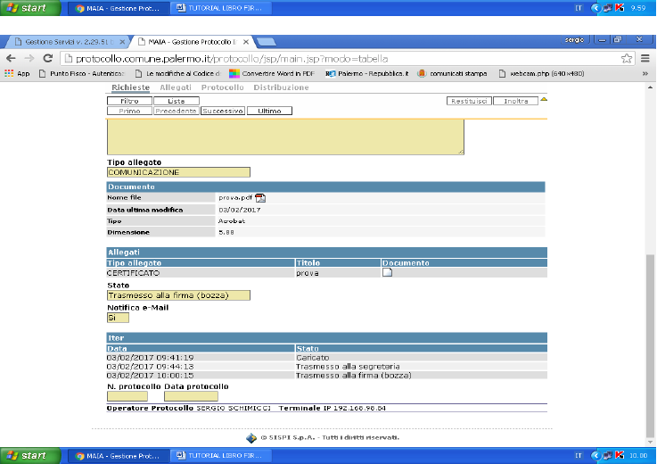

↓

→	Dopo il clic si presenterà la seguente schermata
 
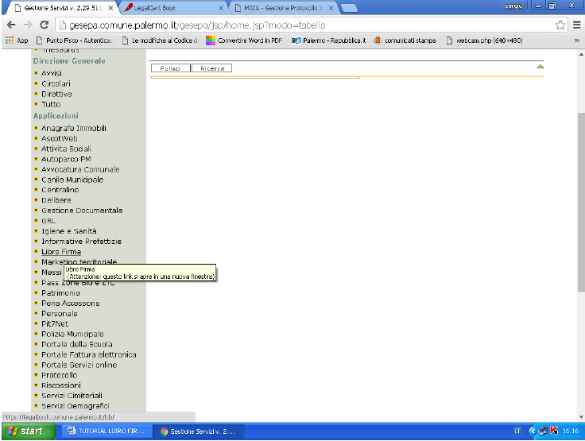
↓

→	Dopo aver inserito i dati corretti ed aver cliccato su “accedi” comparirà la seguente schermata.
Poiché il documento pre-protocollato si trova nello stato di trasmesso alla firma (Bozza) sarà necessario cliccare su Vai alle Bozze
 
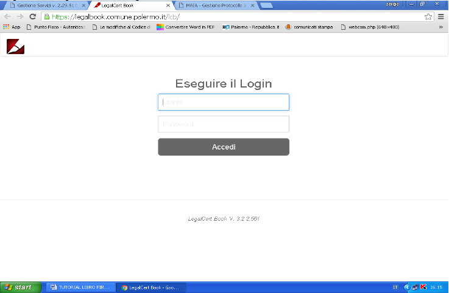
↓

→	La schermata proposta sarà simile alla seguente e nella casella “Plichi” verrà evidenziato in grigio il documento da sottoporre alla firma
 
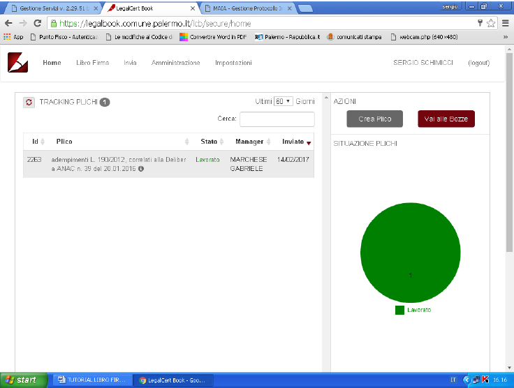
↓

→	Cliccando sul simbolo della penna sarà possibile accedere alla sezione Modifica che consentirà di predisporre il documento alla firma
 
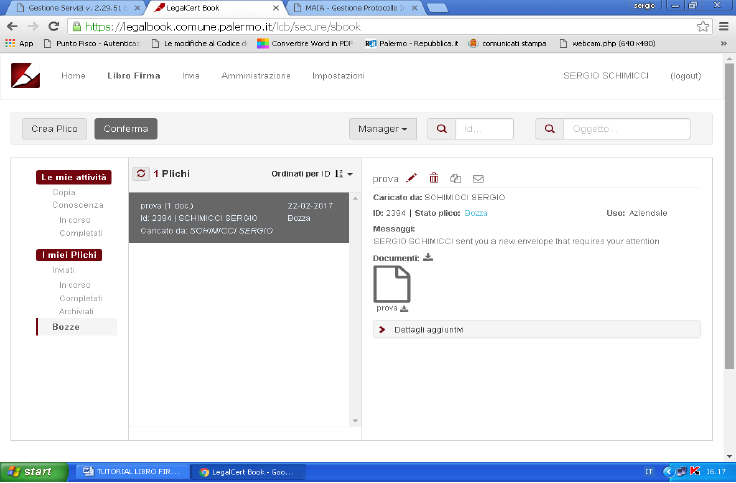
↓

→	La schermata a cui si accederà sarà simile alla seguente
 
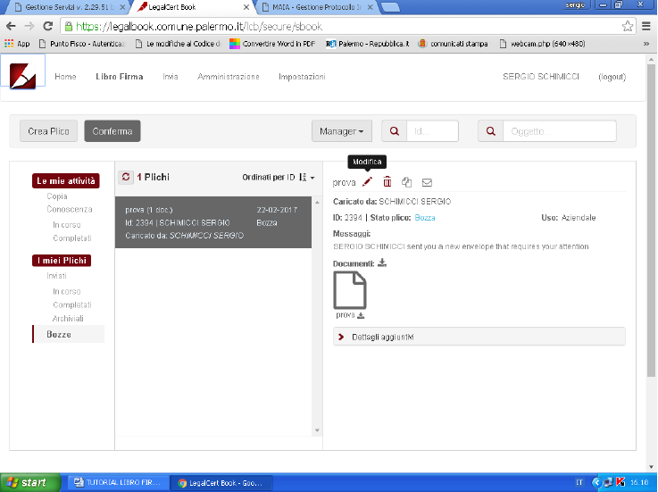
↓

→	Cliccando sul menu a tendina dei destinatari (di firma) è possibile rimuovere il soggetto proprietario del documento dalla lista dei firmatari ed aggiungere il Dirigente (o i Dirigenti) che dovranno firmare digitalmente l’atto. 
 
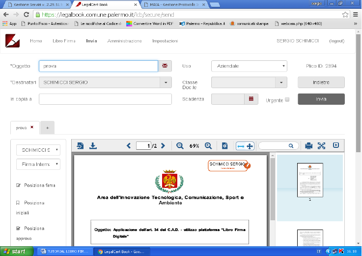
↓

→	Sarà sufficiente trascinare con il mouse verso il lato destro dello schermo il nome del Dirigente firmatario e cliccare sulla X per rimuovere il nome del soggetto proprietario del documento 
 

→	Cliccando sui pulsanti di conferma si avrà completato l’operazione 
 
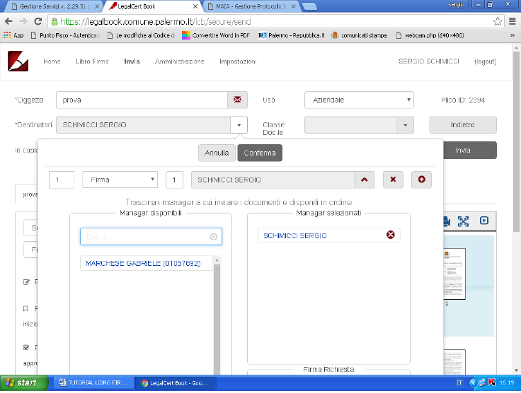
↓
 
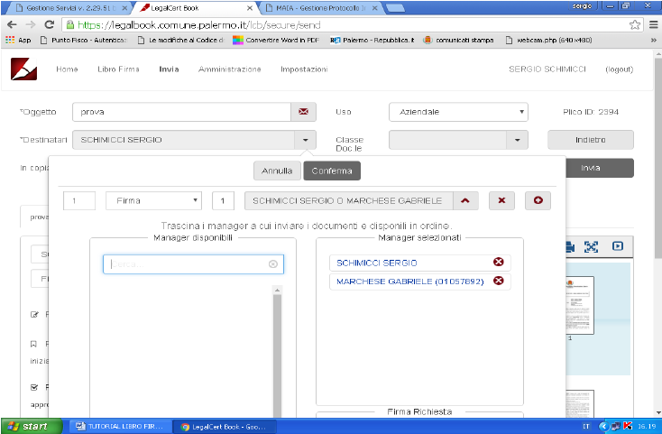
↓

→	La schermata dovrà essere simile alla seguente
 
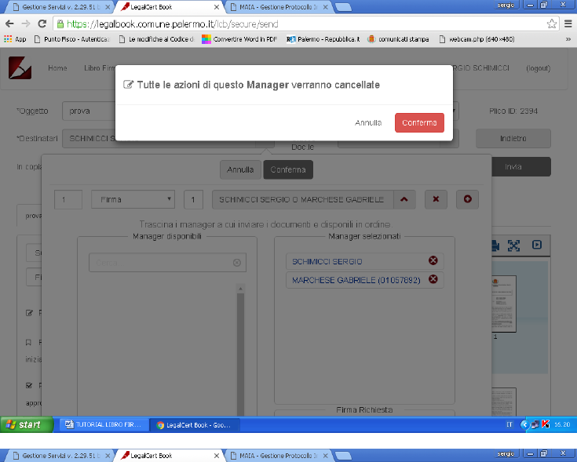
↓

→	Sarà necessario ora selezionare dal menu a tendina la firma digitale. Questa operazione è fondamentale qualora si tratti di un solo dirigente a dover firmare l’atto: dimenticando infatti per errore la firma interna, non si otterrà un documento firmato digitalmente.
La firma interna potrà essere utilizzata invece ad esempio nel caso in cui vi siano due Dirigenti a firmare l’atto e si voglia che uno dei due apponga quella interna e l’altro la digitale.
 
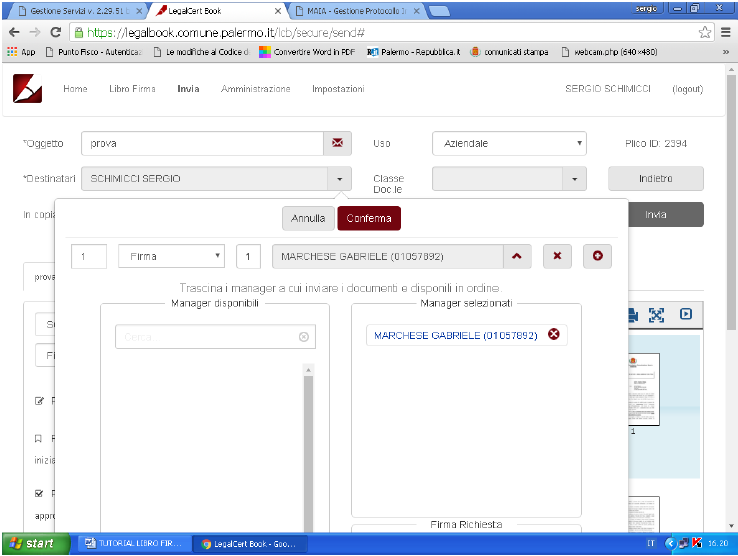
↓

→	Si dovrà poi cliccare su Posiziona Firma 
 
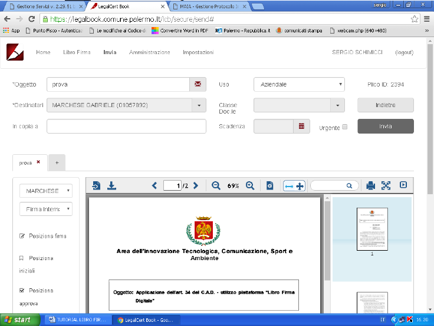
↓

→	Scorrere il documento fino ad individuare il punto in cui compare il nome del Dirigente che sarà anche quello dove apporre il rettangolo arancione della firma

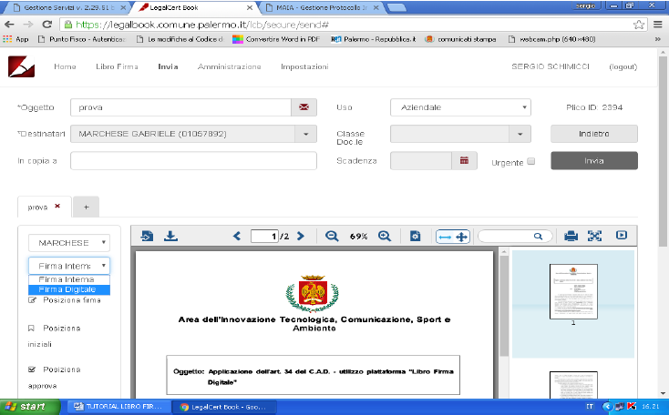
↓

→	Cliccare sul punto desiderato per posizionare la firma (e’ opportuno posizionare il mouse circa 2 cm. sotto il nome). Un rettangolo arancione apparirà recando il nome del Dirigente che deve firmare.
 
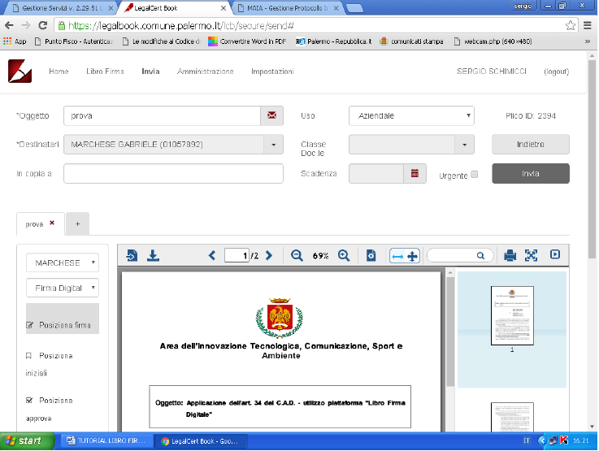
↓

→	Qualora si sia apposta la firma in una posizione sbagliata sarà sufficiente cliccare su sposta e poi trascinare il rettangolo giallo nella posizione desiderata.
 
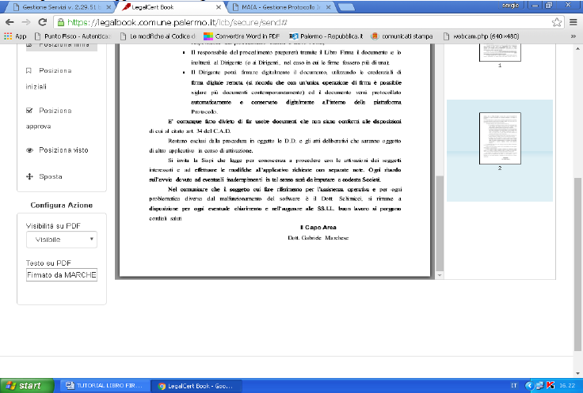
↓

→	Per terminare la procedura bisognerà infine cliccare su Invia
 
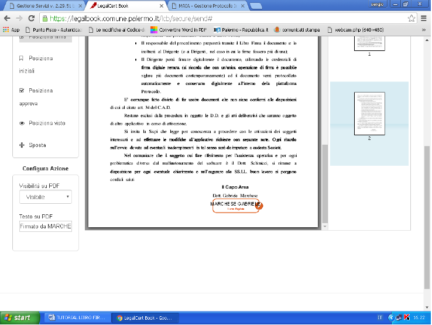
↓

→	Apparirà la frase che il plico è stato inviato con successo.

La fase C è terminata, ha inizio la fase D che è di competenza del Dirigente Firmatario.

