======================================================
Fase D | FIRMA DIGITALE
======================================================

→	Il primo passaggio prevede il collegamento al Libro Firma, accessibile dalla Intracom.
 
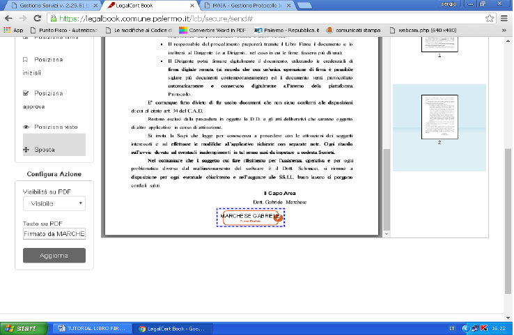
↓

→	Dopo il clic si presenterà la seguente schermata
 
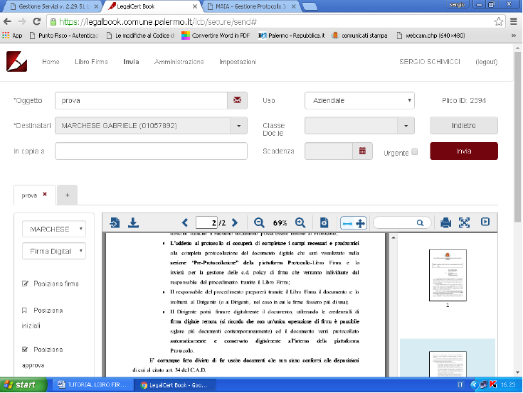
↓

→	Dopo aver inserito i dati corretti ed aver cliccato su “accedi” si presenterà una schermata simile alla seguente
 
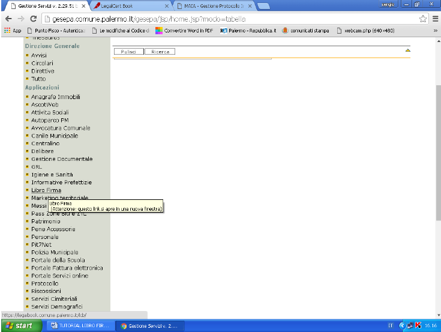
↓

→	Sarà necessario cliccare su uno dei documenti identificati come Nuovo per iniziare il processo di firma digitale

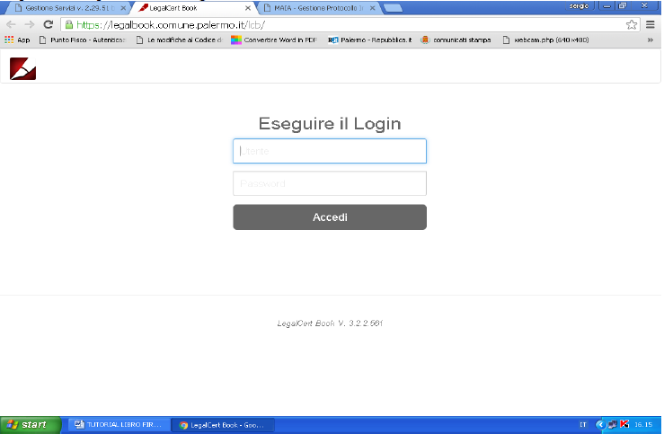
↓

→	Alla comparsa del punto in cui è apposto il rettangolo arancione bisognerà cliccare per trasformare il simbolo di firma da arancione a verde. Se non apparisse direttamente la fine del documento sarà sufficiente scorrere la barra grigia di scorrimento per giungere al punto desiderato.
 
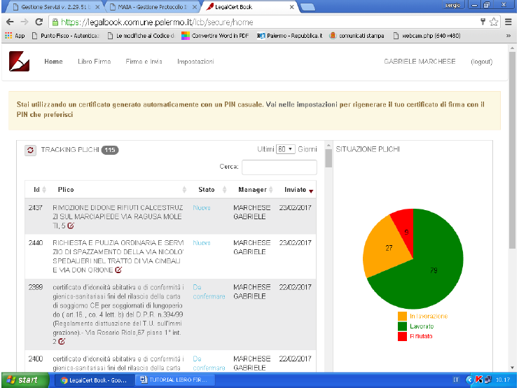
↓

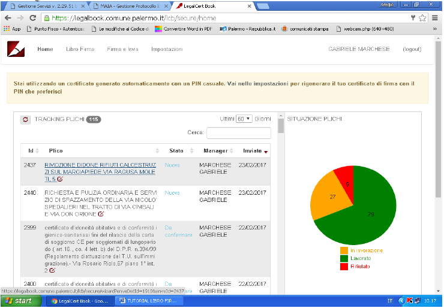
↓
 
→ A questo punto occorrerà cliccare sulla mano con il pollice in su per continuare il processo di firma e generare il codice OTP (che arriverà via sms sul telefono aziendale), dopo aver inserito le credenziali richieste, per completare il processo di firma. 
Nel caso in cui fosse necessario firmare più di un documento cliccare su Fine per esaminare un altro documento da firmare. Alla fine dell’esame di tutti i documenti da firmare comparirà in alto a sinistra dello schermo un pulsante di conferma che permetterà di convalidare tutti i documenti contemporaneamente con un unico processo di firma ed un unico OTP (che arriverà via sms sul telefono aziendale) 
 

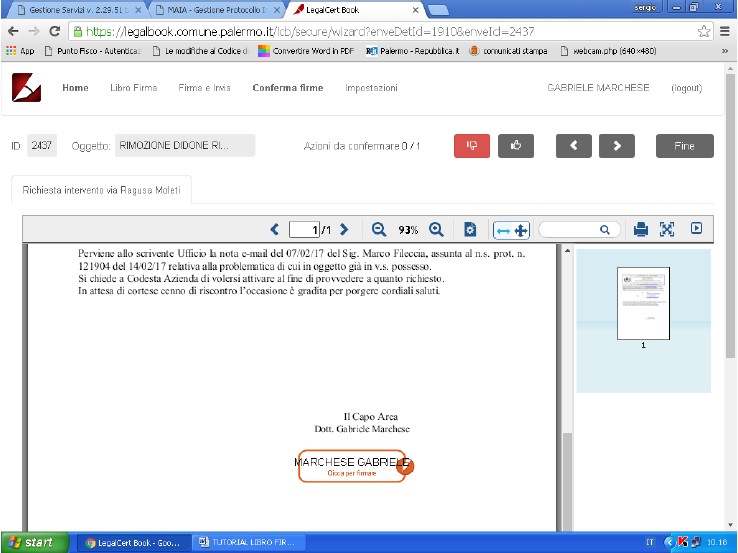
↓

→ Occorrerà inserire le proprie credenziali di firma
 
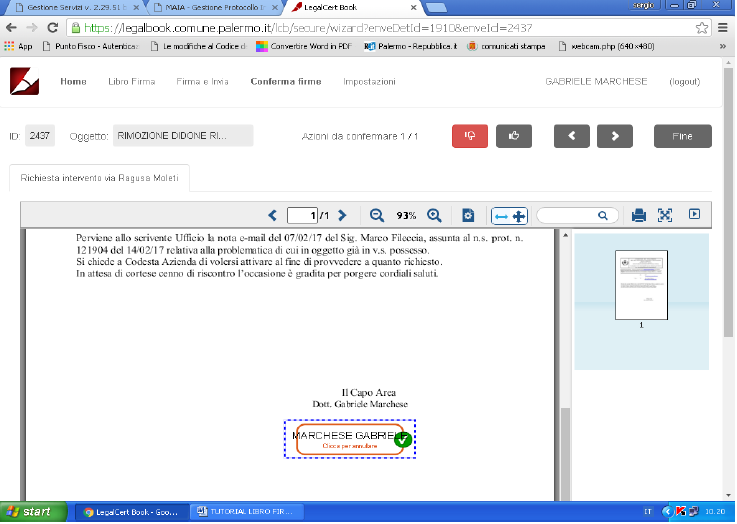
↓

→ Successivamente bisognerà cliccare su Richiedi OTP
 
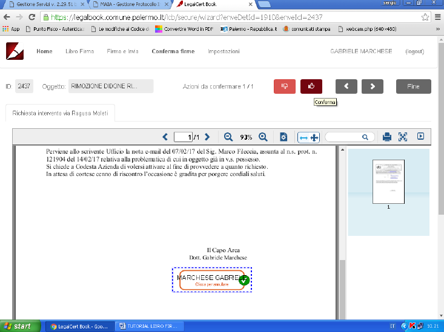
↓

→ Comparirà a questo punto la seguente schermata che richiede l’inserimento del PIN e dell’OTP (che arriverà via sms sul telefono aziendale)
 
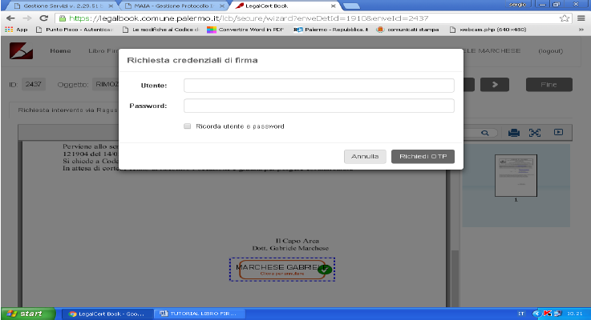
↓

→ In ultimo bisognerà cliccare su Continua per concludere il processo di Firma Digitale
 
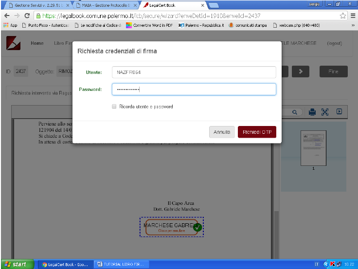
↓

→ A questo punto tornando sulla Home del programma si vedrà che il documento (o i documenti) firmato risultano avere lo Stato di Lavorato evidenziato in colore verde. Il grafico a torta sulla destra riepiloga visivamente la situazione dei documenti.
 
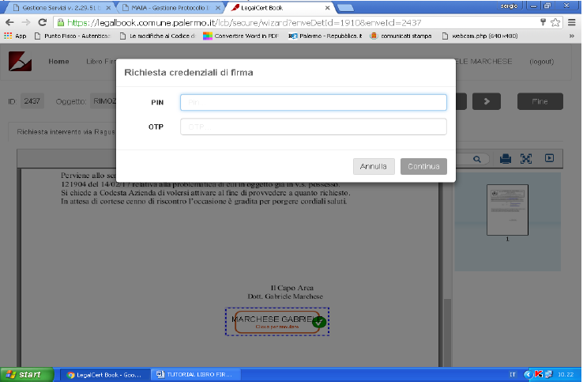
↓

→ Una e-mail automatica informerà il richiedente (colui che nella fase A ha caricato il documento) dell’avvenuto completamento della procedura e del numero e data di protocollo, che sarà nel frattempo stato generato automaticamente.

↓

→ Terminata questa fase, come già detto in premessa, rimarrà l’incombenza di inviare il documento al suo destinatario. Per far ciò, dopo aver visualizzato il numero di protocollo nella sezione Richieste o in quella di Pre-protocollazione, il richiedente o l’addetto al protocollo o il soggetto normalmente deputato all’inoltro della corrispondenza potrà accedere all’archivio protocollo, ricercare il numero e scaricare i file allegati che andranno poi trasmessi via e-mail al destinatario, o in modo cartaceo (qualora il destinatario sia sprovvisto di posta elettronica) apponendo la dicitura “copia cartacea conforme all’originale informatico agli atti dell’ufficio”.

**Buon lavoro!**
