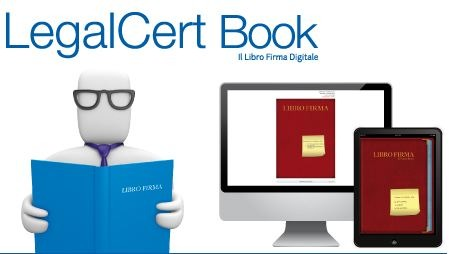

*****
Manuale d'uso dell'applicativo Libro Firma in uso al Comune di Palermo
*****

   
   (`photo by <https://www.io>`_)
   
   
``dematerializzazione`` 

``Codice Amministrazione Digitale``

------

Questo documento è il  manuale dell'applicativo gestionale **Libro Firma**. 

Ha lo scopo di ............

      
.. note::
    a cura di Sergio Schimicci (s.schimicci@comune.palermo.it) 
    
    Read the Docs a cura di Sergio Schimicci e Ciro Spataro, Servizio Innovazione del Comune di Palermo
   

Febbraio 2018 
   
   
------------

.. toctree::
   :maxdepth: 3
   :caption: Indice dei contenuti
   
   faseA.rst
   faseB.rst
   faseC.rst
   faseD.rst
   
   
