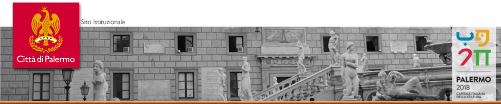

*****
Manuale d'uso dell'applicativo 'Libro Firma-Protocollo' digitale in uso al Comune di Palermo
*****

 
.. raw:: html

    
    
    

   
     
``dematerializzazione``

``Codice Amministrazione Digitale``

------

Il presente Documento vuole essere una breve guida per l’utente nella prima fase della complessa operazione di “passaggio al digitale” del `Comune di Palermo <https://www.comune.palermo.it/>`_, illustrando la procedura operativa da seguire per veicolare digitalmente tutti quei documenti indirizzati ad un soggetto privato o ad un Ente pubblico mediante l’applicativo **LIBRO FIRMA-PROTOCOLLO**.

.. note::
    Manuale d'uso a cura di Sergio Schimicci (s.schimicci@comune.palermo.it). 
    
    Progetto su Github per Read the Docs a cura di Sergio Schimicci e Ciro Spataro (c.spataro@comune.palermo.it). U.O. Transizione al Digitale, Servizio Innovazione, Comune di Palermo.
   

Data di rilascio della versione 1.0 del manuale d'uso: marzo 2018 
   
------------

.. toctree::
   :maxdepth: 3
   :caption: Indice dei contenuti
   
   premessa.rst
   faseA.rst
   faseB.rst
   faseC.rst
   faseD.rst
   
